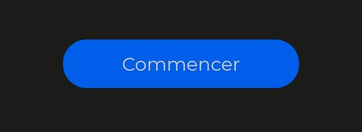

# QuizzApp

## Description rapide du projet
Projet d'application mobile de 4e année à l'ESIEA avec une architecture MVVM.

J'ai développé un quizz avec plusieurs thèmes et niveau diponible.
L'application repose sur une API fourni par <a href="https://openquizzdb.org/" >Open Quizz DB</a>.

## Consignes :
- Language utilisé : Kotlin / Swift
- Architecture MVVM
- Clean architecture
- Utilisation d'une réelle base de données
- Utilisation d'une API REST
- Affichage d'une liste
- Design

## Caractéristique du projet :
- Language utilisé : JavaScript 
- Framework utilisé : React Native
- Architecture MVVM 
- Clean architecture
- Utilisation d'une base de données
- Utilisation d'une API REST
- Affichage d'une liste
- Design :
	- Utilisation de components
	- Couleurs centrées dans un fichier unique
	- Intégration d'une police externe (Montserrat)
	- Intégration d'icone depuis Ionicons
	- Intégration d'un logo
- Les plus :
	- Mise en place de menu dropdown
	- Gestion des états de l'application :
		- Permet de gérer en direct les éléments graphique de l'application (style et components par exemple)
	- Intégration d'une sécurité pour la gestion du temps des requêtes API (1 minute minimum entre chaque requêtes)
	- Intégration d'un partage des questions enregistrées (Pas présent dans la démo final mais bien présent et fonctionnel dans le code)

## Outils techniques utilisés
#### React Native: Framework de développement mobile iOS et Android. 
##### Explication : 
React native est l'un des framework les plus utilisés et utilise du JavaScript comme code source. Le code JS est ensuite converti en code natif sur la plateforme iOS et Android.

##### Remarque :
Dans mon cas, le développement est plus orienté Android. Des fonctionnalités sur iOS n'ont pas pu être configuré. 

##### Librairies principales utilisées :
- <b>mobx :</b> Utilisé pour la structure MVVM
- <b>react-navigation :</b> Utilisé pour la navigation entre les vues de l'application
- <b>react-native-sqlite-storage :</b> Utilisé pour le stockage des données dans l'application
- <b>react-native-vector-icons :</b> Utilisé pour les icones Ionicons 

#### DB Browser for SQLite: Création et insertion des données de base dans l'application
##### Explication
Pour l'initialisation de la base de données, il est plus de simple de créer sa structure et ses données initiales hors de l'application. 
Ensuite, la bdd est intégré dans le répertoire : <b>./android/app/src/main/assets/mydb.db</b>

Les données suplémentaires seront ensuite insérer dans les tables correspondantes.

## Etape de développement
### 1. Recherche de l'API :
L'API de Open Quizz DB se trouve <a href="https://openquizzdb.org/">ici</a>
#### Fonctionnement :
L'API fonctionne avec une clé d'authentification à ajouter dans l'URL avec les autres caractéristiques souhaité.
Elle renvoie une réponse sous le format JSON.
La liste des fonctionnalité se trouve dans sa <a href="https://www.kiwime.com/oqdb/pdf/openquizzdb_api.pdf">documentation</a>

#### Particularités :
- Limité à 1 requête toute les minutes
- Réponse au format JSON

### 2. Recherche et utilisation d'une base de donnée SQLite
La librairie qui nous permet d'utiliser SQLite est : <b>react-native-sqlite-storage</b>
C'est l'une des seules librairies disponnible qui nous permet d'avoir accès à une réelle base de données interne à l'application.

Voici les étapes d'implémentation de la base de données : 
1. Création des tables de la base de données sur DB Browser for SQLite.
2. Insertion des données de base de l'application : 
- Les categories
- Les niveaux
3. Exportation de la base de donnée dans le répertoire assets de android : ./android/app/src/main/assets/mydb.db
4. Implémentation de la base de données dans le code source Javascript dans le fichier App.js
5. Création de la librairie SQLManager pour faire des requêtes sur la base de données.

### 3. Mise en place des requêtes HTTP vers l'API
Création du gestionnaire de requête sur l'API.
Le gestionnaire est ApiManager et se trouve dans le dossier ./src/data.
Elle permet de faire des requêtes sur l'API en fonction de la catégorie et du niveau souhaités et d'en récupérer son contenu

### 4. Mise en place de l'architecture MVVM
Pour le développement MVVM sur react native, nous devons mettre en place 5 composantes : 
	1. La View qui contient les éléments graphiques
	2. Le Controller de la vue qui gère la logique et les interractions avec la vue
	3. Le ViewModel qui fait l'interface entre le Model et le controller.
	4. Le Model qui contient les données de la vue.
	5. Le Provider qui relie tous le Model, le ViewModel et le Controller.

##### Schema d'interraction entre les éléments : 
<p align="center">

</p>

##### Structure détaillée du projet :
```
│   App.js
├───assets
│   │   Colors.js
│   └───fonts
│       └───Montserrat
|           └───AllMontserratFont.ttf
├───components
│   ├───Button
│   │       index.js
│   │       styles.js
│   ├───QuestionCard
│   │       index.js
│   │       styles.js
│   ├───Subtitle
│   │       index.js
│   │       styles.js
│   └───Title
│           index.js
│           styles.js
├───data
│   │   constants.js
│   ├───API
│   │       ApiManager.js
│   │       ApiOptions.js
│   │       index.js
│   └───SQLite
│           constants.js
│           index.js
│           SQLiteManager.js
├───models
│   │   RootStore.js
│   └───domain
│           HomeModel.js
│           QuestionModel.js
├───router
│       home.routes.js
│       index.js
└───screens
    │   constants.js
    ├───Home
    │       HomeController.js
    │       HomeProvider.js
    │       HomeView.js
    │       HomeViewModel.js
    │       styles.js
    └───Questions
            QuestionController.js
            QuestionProvider.js
            QuestionView.js
            QuestionViewModel.js
            styles.js

```

Le démarche à suivre pour la structure MVVM a été donnée par un tutoriel de <a href="https://medium.cobeisfresh.com/level-up-your-react-architecture-with-mvvm-a471979e3f21">Medium</a>

### 5. Création et intégration des components
Pour faciliter la création graphique, j'ai créé un dossier components qui contient tous les éléments graphiques customisés qui sont utiliser dans plusieurs fichiers du projet.

Nous pouvons lister les 4 components et donner leurs caractéristiques rapides : 
1. Button
<p align="center"></p>
<p align="center"></p>
<p align="center"></p>
Le component Button prend en paramètre le texte souhaité, la fonction à executer en cas d'appui et permet de déterminer le style du bouton en fonction de la variable isRaised

2. QuestionCard
<p align="center"></p>
Le component QuestionCard prend en entré uniquement la variable question sous le format JSON. Le component se charge ensuite d'afficher les informations dans la carte.

3. Title
<p align="center"></p>
Component simple qui affiche un titre avec le style propre au titre 

4. Subtitle
<p align="center"></p>
Component simple qui affiche un sous titre avec le style propre au sous titre

### 6. Mise en place des quelques éléments graphiques
Dans cette application, les icones affichées viennent de la librairie Ionicons.

L'icone de l'application a été générer à partir de <a href="http://romannurik.github.io/AndroidAssetStudio/icons-launcher.html#foreground.type=image&foreground.space.trim=1&foreground.space.pad=0.25&foreColor=rgba(96%2C%20125%2C%20139%2C%200)&backColor=rgb(255%2C%20255%2C%20255)&crop=0&backgroundShape=square&effects=none&name=ic_launcher">AndroidAssetStudio</a>.
Elle a ensuite été ajouter dans le répertoire ./android/app/src/main/res/

### 7. Rendu Final
Voici le rendu final (après un montage vidéo pour gagner du temps et éviter la minute d'attente entre chaque question)
<p align="center"> </p>


## Tester le projet
Pour tester ce projet, il faut installer react native sur son ordinateur.
Voici un tutoriel pour le faire :
<a href="https://reactnativecode.com/installing-react-native-windows-tutorial/#:~:text=%20Installing%20React%20Native%20on%20Windows%20Tutorial%20,%3A%20Download%20and%20install%20JDK%20from...%20More%20">Installing React Native on Windows</a>